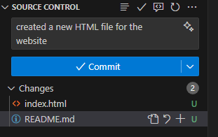
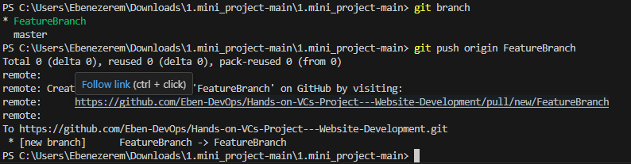
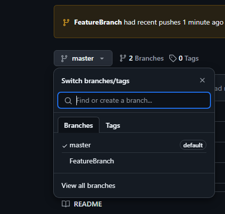
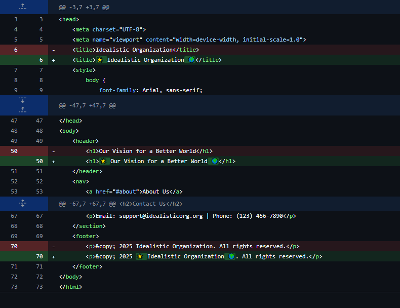
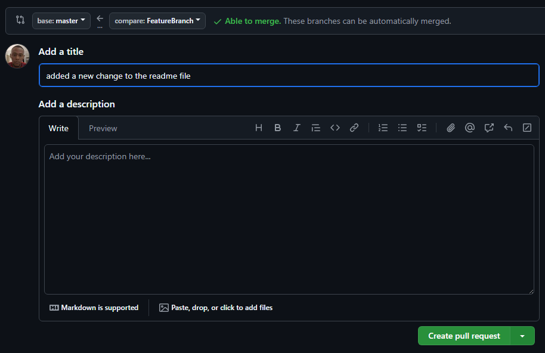
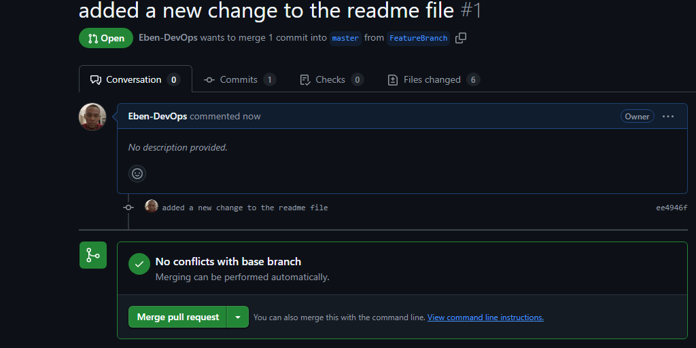
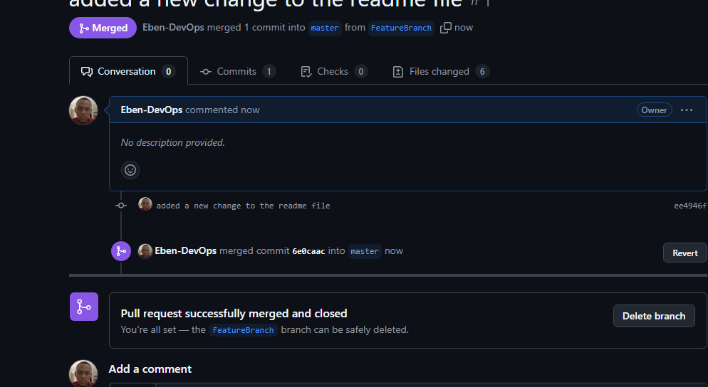

# Hands-On Version Control Project

## Project Overview
This project demonstrates how developers collaborate using Git. It covers essential operations such as branching, merging, and creating pull requests, showcasing best practices for version control in a collaborative environment.

## Key Features
- **Creating the `index.html` File**  
  Setting up the project structure and configuring the remote origin for Git.

  

- **Commit Messages and Push Workflow**  
  Adding meaningful commit messages and pushing changes to the main branch for seamless collaboration among developers.

  

## Getting Started
To get started with this project:
1. Clone the repository:  
   ```bash
   git clone https://github.com/Eben-DevOps/Hands-on-VCs-Project---Website-Development.git
   ```

2. Navigate into the project directory:
```bash
   cd Hands-on-VCs-Project---Website-Development
```

3. Make a change to the Index.html file and cofirm the change on git status


4. Checkout changes to a new feature branch to not add directly to the main.


5. Commit to the changes to the new feature branch


6. Push changes and publish new Branch using git push origin featurebranch


7. We have a new Branch now with our changes and we will create a pull request to the main branch.


8. Changes and additons made to index.HTML file 


9. Merging our changes to the Main Branch


No conflicts


Successfully merged and we cnan choose to delete the branch but I will keep this.
