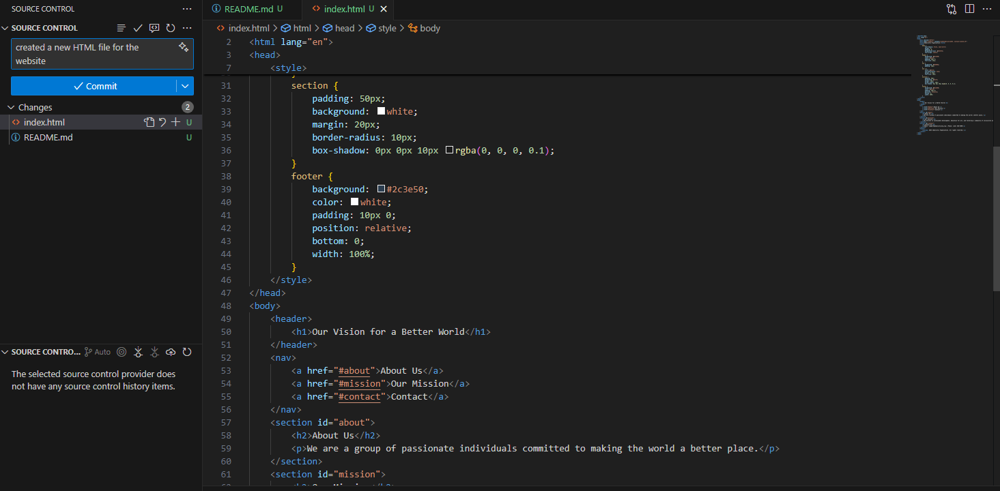

# Hands-On Version Control Project

## Project Overview
This project demonstrates how developers collaborate using Git. It covers essential operations such as branching, merging, and creating pull requests, showcasing best practices for version control in a collaborative environment.

## Key Features
- **Creating the `index.html` File**  
  Setting up the project structure and configuring the remote origin for Git.

  

- **Commit Messages and Push Workflow**  
  Adding meaningful commit messages and pushing changes to the main branch for seamless collaboration among developers.

  

## Getting Started
To get started with this project:
1. Clone the repository:  
   ```bash
   git clone <repository-url>
   ```